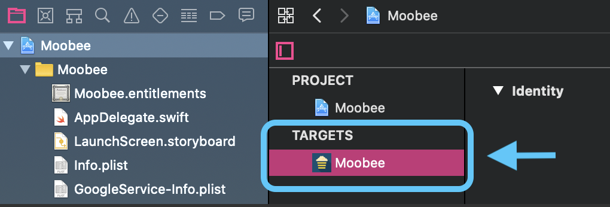
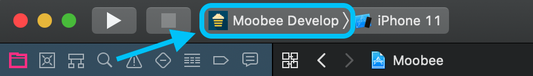
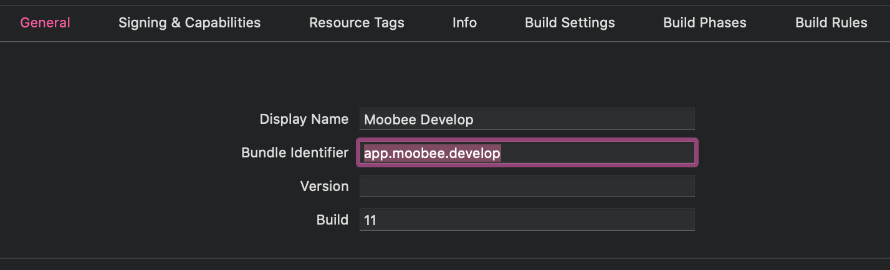
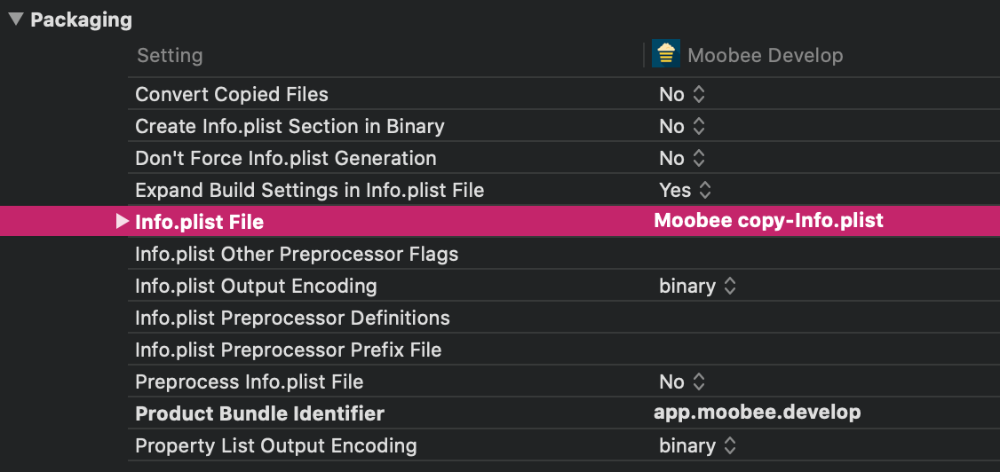
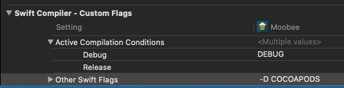
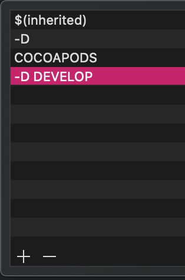

# Rudo: good-practices-ios [remastered]

[TOC]

## Goals

* Make projects easier to maintain.
* Keep discussions on diffs focused on the code's logic rather than its style.
* Make it easier to read and begin understanding unfamiliar code.

Note: This guide is in addition to the official [Swift API Design Guidelines](https://swift.org/documentation/api-design-guidelines/). These rules should not contradict that document.

## Xcode Formatting 

_You can enable the following settings in Xcode by running [this script](resources/xcode_settings.bash) as part of a "Run Script" build phase._

* **Use 2 spaces to indent lines.** [](https://github.com/nicklockwood/SwiftFormat/blob/master/Rules.md#indent)

* **Trim trailing whitespace in all lines.** [](https://github.com/nicklockwood/SwiftFormat/blob/master/Rules.md#trailingSpace)

## Naming 

* **Use PascalCase for type and protocol names, and lowerCamelCase for everything else.**

```swift
protocol SpaceThing {
  // ...
}

class SpaceFleet: SpaceThing {

  enum Formation {
    // ...
  }

  class Spaceship {
    // ...
  }

  var ships: [Spaceship] = []
  static let worldName: String = "Earth"

  func addShip(_ ship: Spaceship) {
    // ...
  }
}

let myFleet = SpaceFleet()
```

* **Name booleans like `isSpaceship`, `hasSpacesuit`, etc.** This makes it clear that they are booleans and not other types.

* **Acronyms in names (e.g. `URL`) should be all-caps except when it’s the start of a name that would otherwise be lowerCamelCase, in which case it should be uniformly lower-cased.**

```swift
// -------- WRONG --------
class UrlValidator {

  func isValidUrl(_ URL: URL) -> Bool {
    // ...
  }

  func isProfileUrl(_ URL: URL, for userId: String) -> Bool {
    // ...
  }
}

let URLValidator = UrlValidator()
let isProfile = URLValidator.isProfileUrl(URLToTest, userId: IDOfUser)

// -------- RIGHT --------
class URLValidator {

  func isValidURL(_ url: URL) -> Bool {
    // ...
  }

  func isProfileURL(_ url: URL, for userID: String) -> Bool {
    // ...
  }
}

let urlValidator = URLValidator()
let isProfile = urlValidator.isProfileUrl(urlToTest, userID: idOfUser)
```
* **Include a hint about type in a name if it would otherwise be ambiguous.**

```swift
// -------- WRONG --------
let title: String
let cancel: UIButton

// -------- RIGHT --------
let titleText: String
let cancelButton: UIButton
```
* **Event-handling functions should be named like past-tense sentences.** The subject can be omitted if it's not needed for clarity.

```swift
// -------- WRONG --------
class ExperiencesViewController {

  private func handleBookButtonTap() {
    // ...
  }

  private func modelChanged() {
    // ...
  }
}

// -------- RIGHT --------
class ExperiencesViewController {

  private func didTapBookButton() {
    // ...
  }

  private func modelDidChange() {
    // ...
  }
}
```

* **The ViewController of one module will be named like: moduleName-Controller.swift**

* **The Storyboard of one module will be named like: moduleName.storyboard** Also, the StoryboardID and the RestorationID will be the name of the controller class.

## Style

* **Don't include types where they can be easily inferred.**

```swift
// -------- WRONG --------
let host: Host = Host()

// -------- RIGHT --------
let host = Host()
```

```swift
enum Direction {
  case left
  case right
}

func someDirection() -> Direction {
  // -------- WRONG --------
  return Direction.left

  // -------- RIGHT --------
  return .left
}
```

* **Don't use `self` unless it's necessary for disambiguation or required by the language.** [](https://github.com/nicklockwood/SwiftFormat/blob/master/Rules.md#redundantSelf)

```swift
final class Listing {

  init(capacity: Int, allowsPets: Bool) {
    // -------- WRONG --------
    self.capacity = capacity
    self.isFamilyFriendly = !allowsPets // `self.` not required here

    // -------- RIGHT --------
    self.capacity = capacity
    isFamilyFriendly = !allowsPets
  }
}
```
* **Add a trailing comma on the last element of a multi-line array.** [](https://github.com/nicklockwood/SwiftFormat/blob/master/Rules.md#trailingCommas)

```swift
// -------- WRONG --------
let rowContent = [
  listingUrgencyDatesRowContent(),
  listingUrgencyBookedRowContent(),
  listingUrgencyBookedShortRowContent()
]

// -------- RIGHT --------
let rowContent = [
  listingUrgencyDatesRowContent(),
  listingUrgencyBookedRowContent(),
  listingUrgencyBookedShortRowContent(),
]
```

* **Place the colon immediately after an identifier, followed by a space.** [](https://github.com/realm/SwiftLint/blob/master/Rules.md#colon)

```swift
// -------- WRONG --------
var something : Double = 0

// -------- RIGHT --------
var something: Double = 0
```

```swift
// -------- WRONG --------
class MyClass : SuperClass {
  // ...
}

// -------- RIGHT --------
class MyClass: SuperClass {
  // ...
}
```

```swift
// -------- WRONG --------
var dict = [KeyType:ValueType]()
var dict = [KeyType : ValueType]()

// -------- RIGHT --------
var dict = [KeyType: ValueType]()
```

* **Place a space on either side of a return arrow for readability.** [](https://github.com/realm/SwiftLint/blob/master/Rules.md#returning-whitespace)

```swift
// -------- WRONG --------
func doSomething()->String {
  // ...
}

// -------- RIGHT --------
func doSomething() -> String {
  // ...
}
```
* **Omit unnecessary parentheses.** [](https://github.com/nicklockwood/SwiftFormat/blob/master/Rules.md#redundantParens)

```swift
// -------- WRONG --------
if (userCount > 0) { ... }
let evens = userCounts.filter { (number) in number % 2 == 0 }
let squares = userCounts.map() { $0 * $0 }

// -------- RIGHT --------
if userCount > 0 { ... }
let evens = userCounts.filter { number in number % 2 == 0 }
let squares = userCounts.map { $0 * $0 }
```

* **Multi-line arrays should have each bracket on a separate line.** Put the opening and closing brackets on separate lines from any of the elements of the array. Also add a trailing comma on the last element. [](https://github.com/nicklockwood/SwiftFormat/blob/master/Rules.md#wrapArguments)

```swift
// -------- WRONG --------
let rowContent = [listingUrgencyDatesRowContent(),
                  listingUrgencyBookedRowContent(),
                  listingUrgencyBookedShortRowContent()]

// -------- RIGHT --------
let rowContent = [
  listingUrgencyDatesRowContent(),
  listingUrgencyBookedRowContent(),
  listingUrgencyBookedShortRowContent(),
]
```
* **Name unused closure parameters as underscores (`_`).** [](https://github.com/realm/SwiftLint/blob/master/Rules.md#unused-closure-parameter)

Naming unused closure parameters as underscores reduces the cognitive overhead required to read
closures by making it obvious which parameters are used and which are unused.

```swift
// -------- WRONG --------
someAsyncThing() { argument1, argument2, argument3 in
  print(argument3)
}

// -------- RIGHT --------
someAsyncThing() { _, _, argument3 in
  print(argument3)
}
```
## Patterns

* **Use caseless `enum`s for organizing `public` or `internal` constants and functions into namespaces.** Avoid creating non-namespaced global constants and functions. Feel free to nest namespaces where it adds clarity.

```swift
enum Environment {

  enum Earth {
    static let gravity = 9.8
  }

  enum Moon {
    static let gravity = 1.6
  }
}
```
* **Default type methods to `static`.** If a method needs to be overridden, the author should opt into that functionality by using the `class` keyword instead.

```swift
// -------- WRONG --------
class Fruit {
  class func eatFruits(_ fruits: [Fruit]) { ... }
}

// -------- RIGHT --------
class Fruit {
  static func eatFruits(_ fruits: [Fruit]) { ... }
}
```
* **Check for nil rather than using optional binding if you don't need to use the value.** [](https://github.com/realm/SwiftLint/blob/master/Rules.md#unused-optional-binding)

Checking for nil makes it immediately clear what the intent of the statement is. Optional binding is less explicit.

```swift
var thing: Thing?

// -------- WRONG --------
if let _ = thing {
  doThing()
}

// -------- RIGHT --------
if thing != nil {
  doThing()
}
```

## File Organization

  * **Limit empty vertical whitespace to one line.** Favor the following formatting guidelines over whitespace of varying heights to divide files into logical groupings. [](https://github.com/realm/SwiftLint/blob/master/Rules.md#vertical-whitespace)

* **Files should end in a newline.** [](https://github.com/realm/SwiftLint/blob/master/Rules.md#trailing-newline)

## Project structure

The project root folder will include the *AppDelegate.swift*, *Info.plist* and *LaunchScreen.storyboard*.
The basic folders of the project will have this order:

- **Configuration:** Basic project configuration files.
- **Modules:** All the modules of the application.
- **Custom Elements:** Custom views, cells and support views are defined here.
- **Helpers:** Help files and extensions.
- **Models:** All models of the application.
- **API:** The API file and the URL and service constructors.
- **Resources:** Sources, localizations, assets, JSONS...

## ViewController example

ViewControllers will extend from ViewModelController, a helper provided by Rudo. It will ask you for a typealias for the viewModel, which will be the class of the viewModel of that controller, and it will automatically create its variable of the corresponding type.

```swift
import UIKit

class MyControllerViewController: UIViewController, ViewModelController {
  typealias T = MyViewModel

  // MARK: - IBOutlets
  @IBOutlet weak var nameLabel: UILabel!

  // MARK: - Properties
  var viewModel: MyViewModel! {
    didSet { fillUI() }
  }

  // MARK: - Life cycle
  override func viewDidLoad() {
    super.viewDidLoad()
    
    fillUI()
  }

  // MARK: - Functions
  func fillUI() {
    if !isViewLoaded { return }
    
    viewModel.name.bindAndFire { [weak self] name in
      self?.nameLabel.text = name
    }
  }

  // MARK: - Observers
  @IBAction func loginButtonPressed(_ sender: UIButton) {
    // ...
  }
}
```

## ViewModel example

```swift
import UIKit

class MyViewModel {
  // MARK: - Properties
  var user: User

  private(set) var _name: Dynamic<String>
  var name: String {
    set { _name.value = newValue }
    get { return _name.value }
  }

  let userService = UserService()

  // MARK: - Init
  init(user: User) {
    self.user = user
    self.name = Dynamic(user.firstName)

    subscribeToNotifications()
  }

  deinit {
    unsubscribeFromNotifications()
  }

  // MARK: - Functions
  fileprivate func subscribeToNotifications() {
    NotificationCenter.default.addObserver(self,
                                           selector: #selector(nameDidChange(_:)),
                                           name: .UserNameDidChange,
                                           object: user)
  }

  fileprivate func unsubscribeFromNotifications() {
    NotificationCenter.default.removeObserver(self)
  }

  func editUser(completionHandler: @escaping ((Bool) -> Void)) {
    userService.editUser(user) { (completed) in
      completionHandler(completed)
    }
  }

  // MARK: - Notifications
  @objc fileprivate func nameDidChange(_ notification: NSNotification) {
    name.value = user.firstName
  }
}

```

## Dynamic variable binding

To bind a dynamic variable, the binding must be weak to avoid strong reference cycle.

```swift
import UIKit

class MyControllerViewController: UIViewController, ViewModelController {
  typealias T = MyViewModel

  // ...
  
  // MARK: - Functions
  func fillUI() {
    if !isViewLoaded { return }
    
    viewModel.name.bindAndFire { [weak self] name in
      self?.nameLabel.text = name
    }
    
    viewModel.address.bind { [weak self] address in
     self?.addressLabel.text = address
    }
  }

  // ...
}

```

## ViewController instance

To instantiate a viewController with viewModel, the viewModel class must conform to the ViewModel protocol, and the controller must conform to the ViewModelController protocol.

```swift
// -------- WITHOUT VIEWMODEL --------
let loginVC = UIViewController.instantiate(viewController: LoginViewController.self)

// -------- WITH VIEWMODEL --------
let personalDataVM = PersonalDataViewModel(user: user!)
let personalDataVC = UIViewController.instantiate(viewController: PersonalDataViewController.self, withViewModel: personalDataVM)
```

## Localization

The names of the discoverable must be in accordance with Android. See the [example of localizables files](https://docs.google.com/spreadsheets/d/1gXUFEIV9UcsNA-pV2nbqaAU-qEZb3CTPQfKpFqJvCWw/edit?usp=sharing)

Export the file as .csv and upload it [here](https://translator.rudo.es/upload/csv/) to download the localization files.

It will have this format: 

```swift
extension String {
    enum Generic: String, Localizable {
        case AppName        = "App_AppName"
        case Button_Done    = "App_Button_Done"
        case Button_Cancel  = "App_Button_Cancel"
    }

    enum Menu: String, Localizable {
        case Hi = "Menu_Hi"
    }
}
```
```swift

"App CompanyName"   = "Rudo";
"App_Button_Done"   = "Aceptar";
"App_Button_Cancel" = "Cancelar";

"Menu_Hi" = "¡Hola %.i% K!";
```

## Root View Controller (RVC)

The rootViewController of an app must be the base controller of the current state of the app. That is, the RVC will be the "Startup" screen when starting the app, but then it will become the "Tabbar" when logging in or registering.

To change the RVC we can use three methods, depending on the transition that we want to show.

The first thing you need is to have a * Helper * called * TopViewController * that includes the following:

```swift
import UIKit

func topMostController() -> UIViewController? {
  guard let window = keyWindow, let rootViewController = window.rootViewController else {
    return nil
  }

  var topController = rootViewController

  while let newTopController = topController.presentedViewController {
    topController = newTopController
  }

  return topController
}

let keyWindow = UIApplication.shared.windows.filter {$0.isKeyWindow}.first
```

**Simple**

This method will be used mainly for the RVC of the app that is set in the *AppDelegate.swift*.

```swift
keyWindow?.rootViewController = {ViewController instanciado}
```

**With animation**

This will be used when we want to use simple transition. It is the most recommended to pass between different states.

```swift
 UIView.transition(with: UIApplication.shared.keyWindow!, duration: 0.3, options: .transitionCrossDissolve, animations: {
     keyWindow?.rootViewController = {ViewController instanciado}
 }, completion: { completed in
     rootVC?.dismiss(animated: false, completion: {
       // maybe do something here
     })
 })

```

**As present**

When you want to pass between different states but you want to use a present transition, use this method.

```swift
self.present(viewController: {ViewController instanciado}) {
  keyWindow?.rootViewController?.dismiss(animated: false) {
    keyWindow?.rootViewController = {ViewController instanciado}
  }
}
```


## **Targets**

### 1. Duplicate target

Right-click the target at the root of the project and duplicate it. Do not select the option to put the iPad settings. Change the name to "{Project} Develop".



### 2. Generate new scheme

Generate a new project scheme from the scheme selector. This generates a development scheme that will target the newly created target.



### 3. Change the bundle



### 4. Configure the info.plist

A new .plist file will have been generated. Move it just below the Info.plist and change its name to "Develop-Info.plist". Change the name also in the project settings.



### 5. Set new flags

In the project settings, look for "flags" and in the "Other Swift Flags" option add "-D DEVELOP" or "-D PRODUCTION" in their corresponding targets.




### How to

```swift
#if DEVELOP
  let SERVER_URL = "http://dev.server.com/api/"
#else
  let SERVER_URL = "http://prod.server.com/api/"
#endif
```

## **Shortcuts**

You can search for "inhibit_all_warnings" in xcode build settings of the PodBundle in your project-work space the set the value to "YES" it will hide all you Pod file warnings.

- **Shift + Command + L:** Show Library.
- **Shift + Command + M:** Show Media Library.
- **⌘ + Option + Shift + 7:** Autocomment.


## **Resources**

**Rudo translator** -> https://translator.rudo.es/upload/csv/

**MVVM** -> https://www.toptal.com/ios/swift-tutorial-introduction-to-mvvm

**WWDC** -> https://developer.apple.com/videos/

**Colored boxes** -> https://stackoverflow.com/questions/6662395/xcode-intellisense-meaning-of-letters-in-colored-boxes-like-f-t-c-m-p-c-k-etc

**Weekly blog** -> https://www.swiftbysundell.com

**Debug** -> https://medium.com/yay-its-erica/xcode-debugging-with-breakpoints-for-beginners-5b0d0a39d711
                 -> https://digitalleaves.com/how-to-debug-ios-apps-xcode-debugger/
                 -> https://www.raywenderlich.com/721-intermediate-debugging-with-xcode-8

